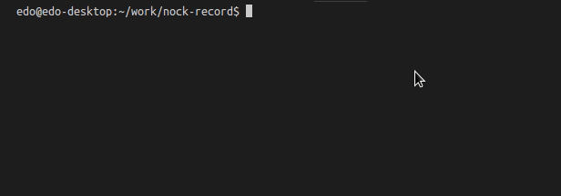

Small wrapper around Nock Back, with improved ergonomics.

[](https://circleci.com/gh/edorivai/nock-record/tree/master)


:heavy_check_mark: Testing framework agnostic\
:heavy_check_mark: Types included\
:heavy_check_mark: Works with promises (so enables `async/await`)

# Workflow

If you're familiar with Jest Snapshots, the following workflow should feel familiar.

1. Record actual HTTP requests on first-time test run
2. Request + response are written to a file
3. A `nock` will be created on subsequent test runs, based on the previous recording



# Usage

```js
import { setupRecorder } from "nock-record";
import { getGithubProfile } from "./githubProfile";

const record = setupRecorder();

describe("#getGithubProfile", () => {
  it("should retrieve user info", async () => {
    // Start recording, specify fixture name
    const { completeRecording, assertScopesFinished } = await record("github-edorivai");

    // Run your function under test
    const result = await getGithubProfile("edorivai");

    // Complete the recording, allow for Nock to write fixtures
    completeRecording();
    // Optional; assert that all recorded fixtures have been called
    assertScopesFinished();

    // Perform your own assertions
    expect(result).toMatchSnapshot();
  });
});
```

# API

## setupRecorder

Sets up your recorder

```ts
// Signature:
function setupRecorder(options?: RecorderOptions): Record;

// Usage:
const record = setupRecorder({ mode: 'record' });
```

### Recorder Options

option|default|description
---|---|---
fixturePath|`{test-directory}/__nock-fixtures__`|The directory where fixtures will be stored
mode|`record`|`"wild" \| "dryrun" \| "record" \| "lockdown"` See [official docs](https://github.com/node-nock/nock#modes) for details

## record

Starts recording HTTP requests


```ts
// Signature:
function record(fixtureName: string, options: nock.NockBackOptions = {}): Promise<Recording>;

// Usage:
const recording = await record("your-fixture-name");
```

## Recording

Returned from a call to [`record`](#record)

 property | type | description
----------|------|-------------
completeRecording | `() => void` | Tells Nock to complete the recording and write any fixtures
assertScopesFinished | `() => void` | Asserts whether all recorded scopes have finish
scopes | `Nock.Scope[]` | All Nock Scopes associated with this recording

### Usage:

```ts
const { completeRecording, assertScopesFinished } = await record("your-fixture-name");

await yourFunctionThatSendsRequests();

completeRecording();
assertScopesFinished();
```

# Running the example

Clone this repo, then run:

```
npm install
npm run build
npm run test-examples
```
